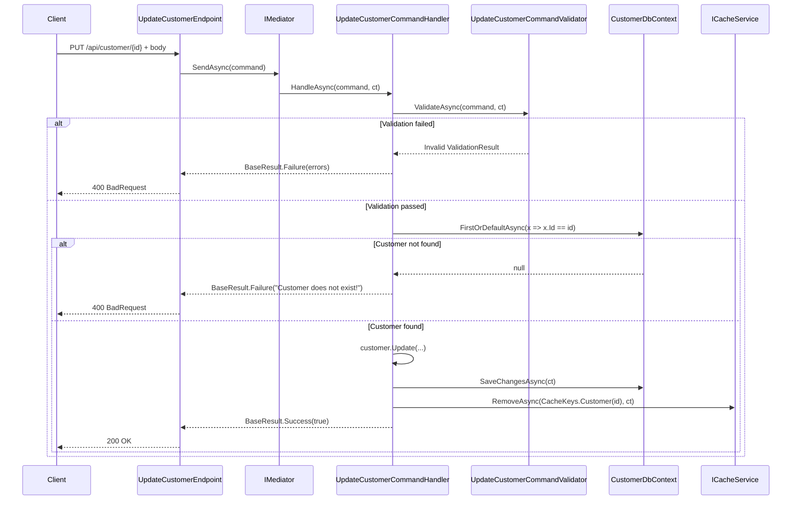

# Design Document: Update Customer

## Overview

Adds a `PUT api/customer/{id}` endpoint to `IS.Customers.API` to update the registration data of an existing customer. The slice follows the solution's vertical pattern: Command -> Validator -> Handler -> Endpoint. The operation invalidates the customer's Redis cache after successful persistence.

### Decision: PUT vs PATCH

**Decision: PUT.**

Rationale:
- All editable fields (LegalName, TradeName, Email, MainPhone, SecondaryPhone, SiteUrl, MainContactName) are sent together in the request body -- the client always replaces the complete state of the mutable fields.
- PATCH would be appropriate if the contract allowed partial updates (only fields present in the body), which would require additional logic (JSON Patch or null-check per field) without clear benefit in this context.
- RegistrationNumber is immutable and not part of the payload, which is consistent with PUT -- the business identifier does not change.
- The REST semantics of PUT ("replace the resource with the sent state") fits correctly when the set of mutable fields is fixed and known.

---

## Architecture

The slice follows the solution's vertical architecture:

```
Features/UpdateCustomer/
  UpdateCustomerCommand.cs
  UpdateCustomerCommandValidator.cs
  UpdateCustomerCommandHandler.cs
  UpdateCustomerEndpoint.cs
```

Execution flow:



---

## Components and Interfaces

### UpdateCustomerCommand

```csharp
public record UpdateCustomerCommand : ICommand<BaseResult<bool>>
{
    [JsonIgnore]
    public Guid Id { get; set; }
    public string LegalName { get; init; }
    public string TradeName { get; init; }
    public string? Email { get; init; }
    public string MainPhone { get; init; }
    public string? SecondaryPhone { get; init; }
    public string? SiteUrl { get; init; }
    public string MainContactName { get; init; }
}
```

- `Id` uses `set` (not `init`) because it is assigned after body deserialization, coming from the route.
- `[JsonIgnore]` prevents `Id` from being read from the body.
- Optional fields (`Email`, `SecondaryPhone`, `SiteUrl`) are nullable.

### UpdateCustomerCommandValidator

Validates all command fields before any database operation. Does **not** inject `CustomerDbContext` -- customer existence check is the exclusive responsibility of the Handler.

Rules:
- `LegalName`: required, max 255 chars.
- `TradeName`: required, max 255 chars.
- `MainPhone`: required, max 50 chars.
- `Email`: optional, max 100 chars (when not null/empty).
- `SecondaryPhone`: optional, max 50 chars (when not null/empty).
- `SiteUrl`: optional, max 100 chars (when not null/empty).
- `MainContactName`: required, max 255 chars.

### UpdateCustomerCommandHandler

Canonical flow:

1. `await _validator.ValidateAsync(request, cancellationToken)` -- returns `Failure` if invalid.
2. `FirstOrDefaultAsync(x => x.Id == request.Id)` -- returns `Failure("Customer does not exist!")` if null.
3. Calls `customer.Update(...)` to apply the fields (logic delegated to the entity).
4. `await _customerDbContext.SaveChangesAsync(cancellationToken)`.
5. `await _cacheService.RemoveAsync(CacheKeys.Customer(customer.Id), cancellationToken)`.
6. Returns `BaseResult<bool>.Success(true)`.

### UpdateCustomerEndpoint

- Route: `PUT api/customer/{id:guid}`
- Inherits `BaseController`
- `[FromRoute] Guid id` -- assigned to `command.Id` before sending to the mediator.
- `[FromBody] UpdateCustomerCommand command`
- Responses: `200 OK` (success) | `400 BadRequest` with `BadRequestProblemDetails` (failure).

### Update method on the Customer entity

A new domain method `Update` is added to the `Customer` entity:

```csharp
public void Update(string legalName, string tradeName, string? email,
                   string mainPhone, string? secondaryPhone, string? siteUrl,
                   string mainContactName)
{
    LegalName = legalName;
    NormalizedLegalName = legalName.NormalizeToUpper();
    TradeName = tradeName;
    NormalizedTradeName = tradeName.NormalizeToUpper();
    Email = email;
    MainPhone = mainPhone;
    SecondaryPhone = secondaryPhone;
    SiteUrl = siteUrl;
    MainContactName = mainContactName;
}
```

---

## Data Models

No database migration is needed -- all fields already exist in the `Customers` table.

Fields affected on the `Customer` entity:

| Field               | Type    | Nullable | Updated by           |
|---------------------|---------|----------|----------------------|
| LegalName           | string  | no       | direct assignment    |
| NormalizedLegalName | string  | no       | `NormalizeToUpper()` |
| TradeName           | string  | no       | direct assignment    |
| NormalizedTradeName | string  | no       | `NormalizeToUpper()` |
| Email               | string? | yes      | direct assignment    |
| MainPhone           | string  | no       | direct assignment    |
| SecondaryPhone      | string? | yes      | direct assignment    |
| SiteUrl             | string? | yes      | direct assignment    |
| MainContactName     | string? | yes      | direct assignment    |

`RegistrationNumber` is **immutable** -- it is not part of the command and is not changed.

---

## Correctness Properties

*A property is a characteristic or behavior that must be true in all valid executions of the system -- essentially, a formal assertion about what the system must do. Properties serve as a bridge between human-readable specifications and machine-verifiable correctness guarantees.*

### Reflection on properties identified in prework

The prework identified the following criteria as PROPERTY candidates:

- **1.2** -- Normalization of LegalName/TradeName: pure domain logic in the entity, fully testable without infrastructure.

The remaining criteria were classified as EXAMPLE, EDGE_CASE, INTEGRATION, or SMOKE. After reflection, there is no redundancy: the single identified property is unique and cannot be combined with another.

---

### Property 1: Name normalization preserves the NormalizeToUpper invariant

*For any* non-null and non-empty `legalName` and `tradeName` strings provided to `Customer.Update(...)`, after execution, `NormalizedLegalName` must equal `legalName.NormalizeToUpper()` and `NormalizedTradeName` must equal `tradeName.NormalizeToUpper()`.

**Validates: Requirements 1.2**

---

## Error Handling

The `GlobalExceptionHandler` registered via `AddGlobalExceptionHandler()` catches all unhandled exceptions and returns `500 ProblemDetails`. No try/catch is needed in the Handler or Endpoint.

Business error mapping:

| Scenario               | Handler return                                    | HTTP |
|------------------------|---------------------------------------------------|------|
| Validation failure     | `BaseResult.Failure(errors dictionary)`         | 400  |
| Customer not found     | `BaseResult.Failure("Customer does not exist!")`| 400  |
| Success                | `BaseResult.Success(true)`                      | 200  |